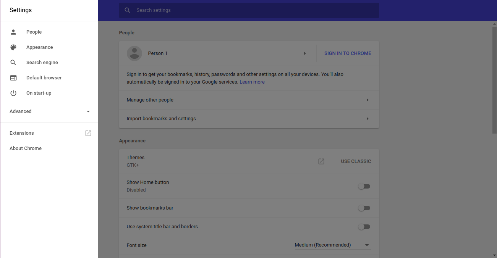
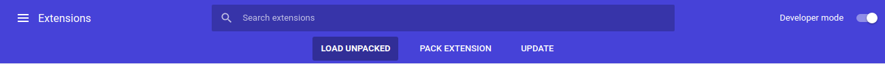

# KnowMore-Client

* Clone the repository `https://github.com/sayak119/KnowMore-Client`.
* After starting the [Know More Server](https://github.com/sayak119/KnowMore-Server) go to settings in Chrome browser and select extension.

* Toggle Developer mode to On and select **Load Unpacked** and select the KnowMore-Client and click on Open.

* Now make a twitter account or login to one and test **Know More**
